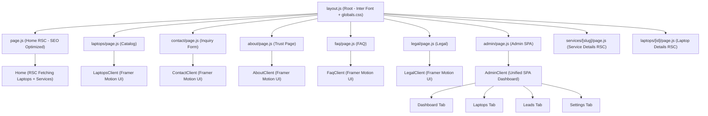

# NextTop Laptop Store – Frontend Architecture

## Tech Stack
- **Framework**: Next.js 16 (App Router, Turbopack)
- **Styling**: Tailwind CSS v4 + Inline Flexbox/Grid for robust complex layouts
- **Animation**: Framer Motion (for premium Gen-X aesthetic, glassmorphism, glowing orbs)
- **UI Components**: Shadcn/UI (initialized), Lucide React icons
- **Fonts**: Inter (Google Fonts, via next/font)
- **Type**: JavaScript (JSX)

## Pages & Components



## Key Design Decisions
- **Ultra-Premium Aesthetic (Gen-X Series)**: Previously replaced standard Tailwind pages with `framer-motion` integrated `*Client.jsx` components, but the homepage (`page.js`) has been refactored back to a **Server Component** to heavily prioritize SEO and Core Web Vitals.
- **Glassmorphism & Neon Orbs**: Dark base `#030712`, with animated blurred background glowing orbs (`cyan`, `blue`, `purple`).
- **Unified Admin Panel SPA**: The `/admin`, `/admin/laptops`, `/admin/leads`, and `/admin/settings` routes all load a single interactive `AdminClient` SPA component for seamless transitions.
- **Inquiry-First**: Every page focuses on high conversions, capturing leads natively and sending them to the backend API (`POST /api/leads`).

## Directory Structure
```
src/
├── app/
│   ├── layout.js          # Root layout
│   ├── globals.css        # Tailwind V4 + globals
│   ├── page.js            # Home Server Component (SEO optimized)
│   ├── laptops/           
│   │   ├── page.js        # Wraps LaptopsClient
│   │   └── [id]/page.js   # RSC fetches laptop from live API
│   ├── services/          
│   │   └── [slug]/page.js # RSC fetches service from live API
│   ├── contact/page.js    # Wraps ContactClient
│   ├── about/page.js      # Wraps AboutClient
│   ├── faq/page.js        # Wraps FaqClient
│   ├── legal/page.js      # Wraps LegalClient
│   └── admin/             
│       ├── page.js        # Wraps AdminClient (initialTab="dashboard")
│       ├── laptops/       # Wraps AdminClient (initialTab="laptops")
│       ├── leads/         # Wraps AdminClient (initialTab="leads")
│       └── settings/      # Wraps AdminClient (initialTab="settings")
└── components/
    ├── Header.jsx          
    ├── Footer.jsx          
    ├── HomeClient.jsx      # Animated Homepage UI
    ├── AdminClient.jsx     # Unified Admin SPA
    └── [Other *Client.jsx] # Animated UI components
```
